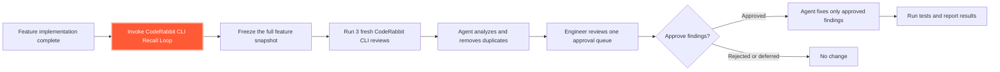

# CodeRabbit CLI Recall Loop

Run three independent CodeRabbit reviews after a feature is complete, consolidate
duplicate findings, and let the engineer decide what gets fixed.

## How it works



Invoke the highlighted step with `$coderabbit-cli-review-loop` in Codex or
`/coderabbit-cli-review-loop` in Claude Code.

The skill reviews one frozen feature snapshot from three temporary clones. Each
clone presents the complete feature—committed, staged, unstaged, and untracked
changes—as an uncommitted diff. This creates three independent review contexts
without changing the developer's working directory.

The agent then merges findings that describe the same root cause. The engineer
receives one numbered list containing the severity, location, impact, review
frequency, agent assessment, and proposed fix. **Nothing is changed without
explicit human approval.**

## Prerequisites

- CodeRabbit CLI 0.4.0 or newer, installed and authenticated.
- Claude Code or Codex with the skill installed.
- A Git repository on a normal branch with a completed feature.
- A known target branch or feature base commit.
- Initial tests and static checks completed.
- No credentials or private material in the feature diff.
- Capacity for three normal CodeRabbit CLI reviews.

CodeRabbit automatically uses the repository and account configuration already in
place. The skill uses normal reviews, never `--light`, and does not override the
review profile.

## Install and invoke

Extract `coderabbit-cli-review-loop.zip` into:

- Codex: `~/.codex/skills/`
- Claude Code project: `.claude/skills/`
- Claude Code personal: `~/.claude/skills/`

Invoke it after completing the feature:

```text
Codex:       $coderabbit-cli-review-loop review this completed feature
Claude Code: /coderabbit-cli-review-loop
```

## Included in the package

- `SKILL.md` — workflow, deduplication, and human-approval instructions.
- `scripts/review_fresh.sh` — creates each isolated review and enforces the
  three-review limit.
- `agents/openai.yaml` — Codex display metadata and default prompt.

## Why three reviews?

In a controlled single-repository experiment, three fresh uncommitted reviews
found 9 of 10 known core defects with 96.2% finding precision. Results will vary by
repository; deterministic tests remain essential.
