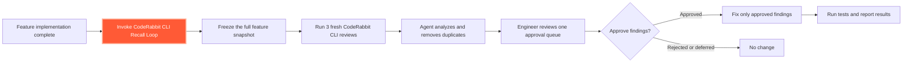

# CodeRabbit CLI Recall Loop

A reusable skill for running three independent CodeRabbit CLI reviews after a
feature is complete. It consolidates duplicate findings into one approval queue
and keeps the engineer in control of every code change.

## Workflow



The skill reconstructs the complete feature diff in a new temporary clone for
each review. Committed, staged, unstaged, and untracked feature changes are
presented as one uncommitted diff, giving CodeRabbit three independent review
contexts without modifying the developer's working directory.

## Human approval is required

The agent collects all three reviews before changing code. It splits composite
comments, merges duplicate root causes, and presents each unique finding with its
severity, location, impact, review frequency, agent assessment, and proposed fix.

No code is changed, staged, or committed until the engineer explicitly approves
specific findings. The agent applies only approved fixes and does not start
another review cycle without approval.

## Prerequisites

- CodeRabbit CLI 0.4.0 or newer, installed and authenticated.
- Claude Code or Codex with skill support.
- A Git repository on a normal branch with a completed feature.
- A known target branch or feature base commit.
- Initial tests and static checks completed.
- No credentials or private material in the feature diff.
- Capacity for three normal CodeRabbit CLI reviews.

The skill uses CodeRabbit's existing repository and account configuration. It
does not select or override the configured review profile and never uses
`--light`.

## Install

Download [coderabbit-cli-review-loop.zip](./coderabbit-cli-review-loop.zip) and
extract it into the appropriate skills directory:

```text
Codex personal:       ~/.codex/skills/
Claude Code project:  .claude/skills/
Claude Code personal: ~/.claude/skills/
```

The extracted path should end in:

```text
coderabbit-cli-review-loop/SKILL.md
```

## Invoke

Run the skill after feature implementation is complete:

```text
Codex:       $coderabbit-cli-review-loop review this completed feature
Claude Code: /coderabbit-cli-review-loop
```

## Repository contents

```text
.
├── README.md
├── coderabbit-cli-review-loop.zip
└── coderabbit-cli-review-loop/
    ├── SKILL.md
    ├── agents/
    │   └── openai.yaml
    └── scripts/
        └── review_fresh.sh
```

- `SKILL.md` defines the review, deduplication, and approval workflow.
- `review_fresh.sh` creates each isolated review context and enforces a maximum of
  three successful reviews for an exact snapshot.
- `openai.yaml` provides Codex display metadata and the default prompt.

## Evidence and scope

In a controlled single-repository experiment, three fresh uncommitted reviews
collectively found 9 of 10 known core defects, and 25 of 26 reported findings were
verified. Results will vary by repository, and deterministic tests remain
essential.
